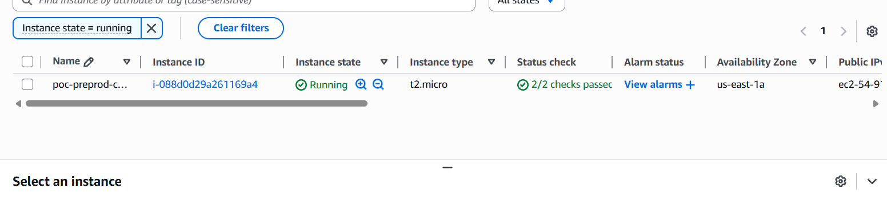
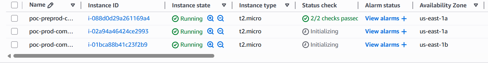
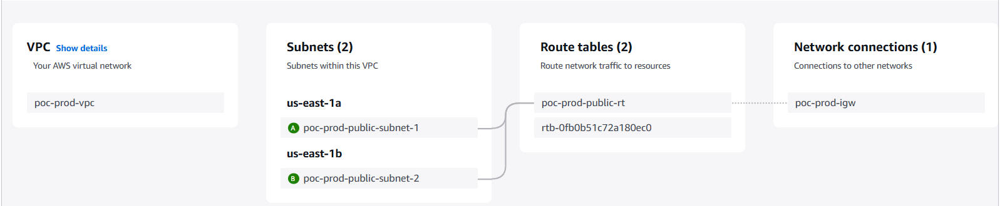
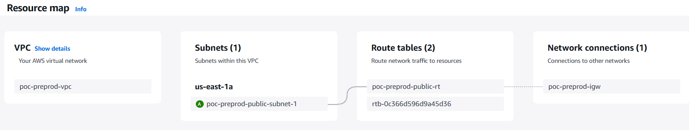
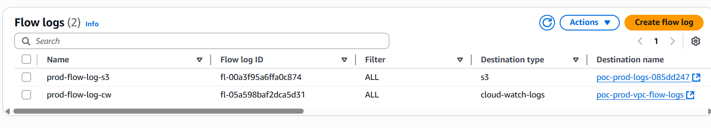
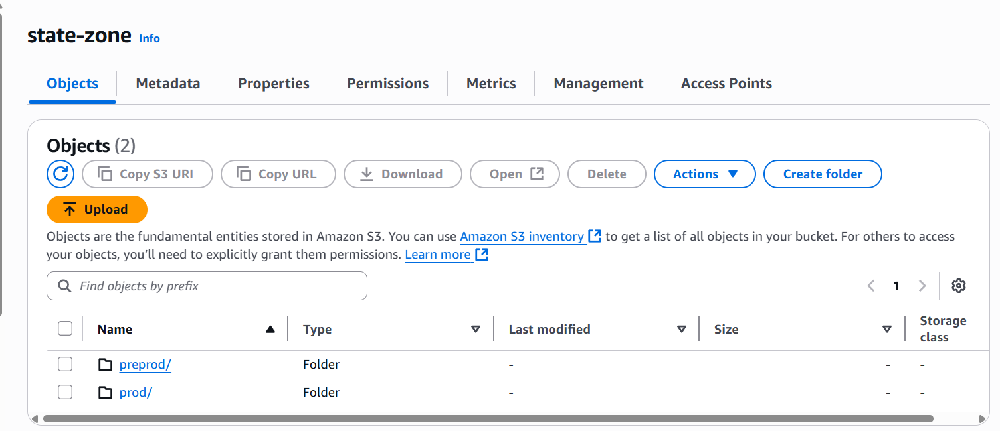
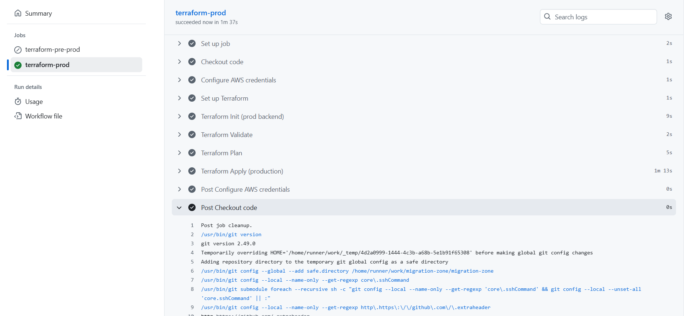
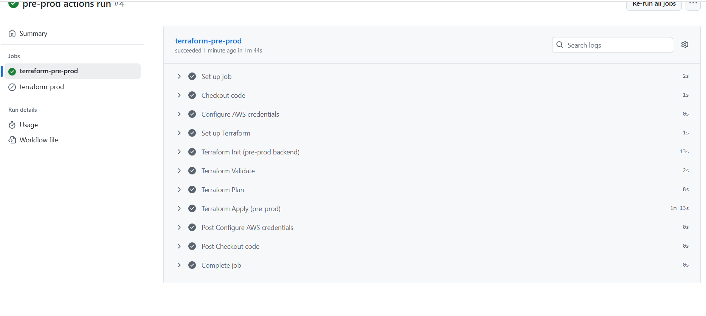

# 🚀 <span style="color:#7B2FF2">Terraform AWS Landing Zone</span> – <span style="color:#F357A8">Free Tier POC</span>


<p align="center">
  
  
  
</p>

<p align="center">
  
  
</p>

<p align="center">
  
  
</p>

<p align="center">
  
</p>

<p align="center">
  
  <br><sub><em>Remote state is securely managed in S3 with DynamoDB state locking for safe, collaborative IaC.</em></sub>
</p>

> **Purpose:** Demonstrating a fully automated AWS Landing Zone for pre-prod and prod environments using <strong>Terraform</strong> and <strong>GitHub Actions</strong> – all on the <strong>AWS Free Tier</strong>.

---

## 🌐 Project Overview


<p align="center">
  
  
</p>

This project showcases an end-to-end **Infrastructure as Code (IaC)** solution to provision and manage cloud infrastructure on AWS using Terraform. It includes:

- A secure and scalable **Landing Zone** (VPC, subnets, route tables, security groups, and EC2).
- Separate **pre-prod** and **prod** environments using isolated folders and Git branches.
- Centralized **logging (CloudWatch + S3)** in the production environment.
- A **CI/CD pipeline** using GitHub Actions to automatically apply infrastructure changes on push and merge events.

---


---


## 🗺️ Visual Overview

<details>
<summary><strong>Click to expand more architecture & pipeline diagrams</strong></summary>

<p align="center">
  
</p>

</details>

---

## 📁 Project Structure

```
terraform-landing-zone/
│
├── modules/
│   ├── network/        # VPC, subnets, IGW, route tables
│   ├── compute/        # EC2 instances and security groups
│   └── logging/        # S3 + CloudWatch + VPC Flow Logs (Prod only)
│
├── envs/
│   ├── pre-prod/       # Pre-prod environment Terraform files
│   └── prod/           # Production environment Terraform files
│
├── zone-keys/          # SSH key pair for EC2 access
│
├── .github/workflows/
│   └── zone.yml   # GitHub Actions CI/CD workflow
│
└── README.md           # Project documentation
```

---


---

## ⚙️ Terraform Workflow


```bash
# Navigate to environment folder
cd envs/pre-prod  # or envs/prod

# Initialize Terraform
terraform init

# Check formatting and validate
terraform fmt -check
terraform validate

# Plan infrastructure
terraform plan -var-file=terraform.tfvars

# Apply infrastructure
terraform apply -auto-approve -var-file=terraform.tfvars

# Destroy infrastructure (optional)
terraform destroy -auto-approve -var-file=terraform.tfvars
```

---


---


## 🚦 GitHub Actions CI/CD

<div align="center">
  
</div>

- **Branch: pre-prod**
  - On `push` → Runs `init`, `validate`, `plan`, `apply` on pre-prod infra.
- **Branch: prod**
  - On `merge` → Runs `init`, `validate`, `plan`, `apply` on production infra.

<div align="center">
  
</div>

🔐 **Secrets Required in GitHub Repository:**
- `AWS_ACCESS_KEY_ID`
- `AWS_SECRET_ACCESS_KEY`

📁 **Workflow file path:** `.github/workflows/zone.yml`

---

---


---


## 📌 Terraform Concepts Used

<details>
<summary>Click to expand</summary>

- **Modular Design:** `network`, `compute`, `logging`
- **Variables & tfvars:** Flexible, DRY configuration
- **Remote Backend:** S3 + DynamoDB (see S3 diagram above)
- **State Locking:** Safe, collaborative changes
- **Lifecycle Blocks:** `taint`, `import`, and more
- **Dynamic Resource Count:** Smarter infra with variables
- **CI/CD:** GitHub Actions for full automation

</details>

---


## 🧠 Key Notes

<ul>
  <li>💡 <b>Smart Logging:</b> Logging module is restricted to production using <code>count = var.env == "prod" ? 1 : 0</code>.</li>
  <li>🏷️ <b>Naming Convention:</b> Resource naming follows <code>poc-&lt;env&gt;-&lt;resource&gt;</code> convention.</li>
  <li>🔒 <b>Security:</b> EC2 key permissions managed before apply (<code>chmod 400 zone-keys/access.pem</code>).</li>
  <li>🌍 <b>Visuals:</b> See architecture, pipeline, and remote state diagrams above for a clear understanding.</li>
  <li>🚀 <b>Zero-Touch Deployments:</b> Push to pre-prod, merge to prod, and your infra is live!</li>
  <li>🧩 <b>Reusable Modules:</b> Plug-and-play for new environments or AWS accounts.</li>
  <li>📊 <b>Observability:</b> Centralized logging and flow logs for production.</li>
</ul>

---


## 🥂 Special Thanks

<p align="center">
  
</p>

<p align="center">
  Thanks to the reviewer and mentors for their guidance.<br>
  <b>This POC is built with scalability and DevOps best practices in mind.</b>
</p>

---

<p align="center" style="font-size:1.2em;">
  <em>“Build infrastructure like software. Test it, automate it, and make it reusable.”</em>
</p>

<p align="center">
  
</p>